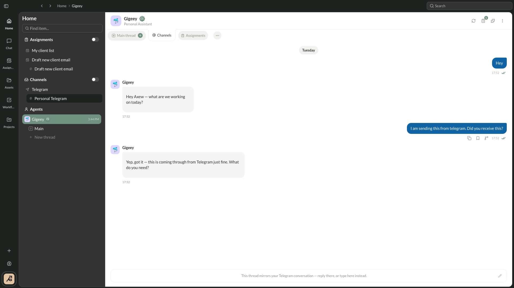
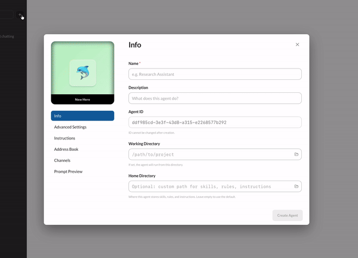
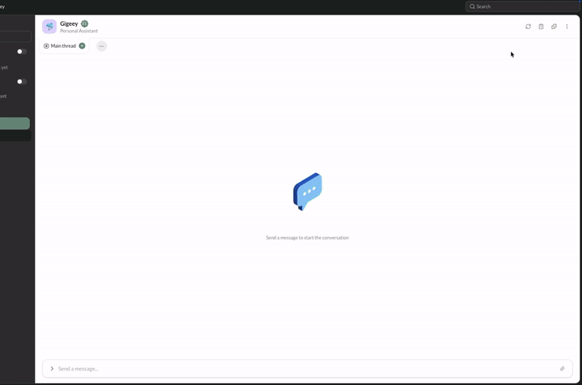
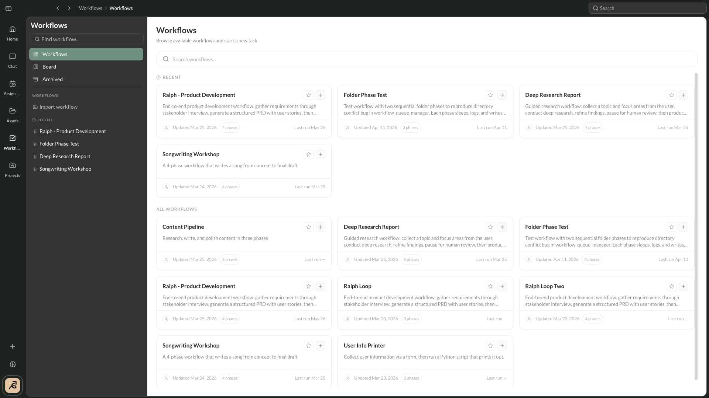

<p align="center">
  
</p>

<h1 align="center">Launchpad Studio</h1>

<p align="center">
  <strong>Build Your Team...without hiring one.</strong><br>
  A local-first desktop workspace where you build a team of specialized AI agents that
  delegate to each other, work on their own schedule, and get better every time you use them.
</p>

<p align="center">
  <a href="https://github.com/gigeey/launchpad-studio-releases/releases/latest">Download</a> ·
  <a href="#quick-start">Quick start</a> ·
  <a href="#what-the-app-contacts">What it contacts</a> ·
  <a href="#security--permissions">Security</a> ·
  <a href="#the-autonomy-ladder">How it works</a> ·
  <a href="#documentation">Docs</a> ·
  <a href="#architecture">Architecture</a> ·
  <a href="https://github.com/gigeey/launchpad-studio/issues">Issues</a> ·
  <a href="https://www.gigeey.com/">gigeey.com</a>
</p>

<p align="center">
  <a href="https://github.com/gigeey/launchpad-studio/actions/workflows/ci.yml"></a>
  <a href="LICENSE"></a>
  
  
</p>

<p align="center">
  
</p>

---

Most agent tools give you one chat window and one model. Launchpad Studio gives you an
**org**: a roster of specialized agents — a Frontend, a Backend, a Debugger, a Reviewer —
each with its own instructions, skills, memory, and model, that hand work to one another,
pick tasks up on a schedule without being asked, and **compound what they learn** so your
hands-on time trends toward zero.

It runs on your machine, talks to any model provider you point it at, and is built to keep
your token bill sane: put an expensive, capable model in the coordinator's seat and delegate
the grunt work to cheaper ones — or flip it, and let a cheap coordinator consult a stronger
specialist only when it needs to. We built Launchpad Studio this way, and it's how we shipped
it.

<table>
<tr><td width="30%"><b>An org, not a chat window</b></td><td>Compose specialized agents with their own persona, instructions, skills, memory, tools, and model. Agents delegate to each other through address books — and every agent can itself be a coordinator.</td></tr>
<tr><td><b>Mix and match models</b></td><td>Provider and model live <i>per agent</i>. Run a strong model where the thinking is, cheap models where the grunt work is. No lock-in — swap providers per agent.</td></tr>
<tr><td><b>Works while you don't</b></td><td>Assignments run agents on a schedule (cron), on a webhook, or when a connected data source changes — so the same agent you chat with can also review every PR overnight, applying your preferences.</td></tr>
<tr><td><b>Hands off whole goals</b></td><td>Projects let you hand over an objective. The agent interviews you to capture intent, drives itself with tasklists, and is gated by an independent verifier that checks the work against the goal before it can call the job done.</td></tr>
<tr><td><b>Gets better with use</b></td><td>Agents observe their own work, distill reusable skills and memories from it, and surface them to you for a one-click accept. Every session leaves the org a little sharper.</td></tr>
<tr><td><b>Local-first & extensible</b></td><td>Your data stays on your machine. Extend agents with Skills, Plugins, and MCP Connectors, and codify repeatable processes as multi-phase Workflows.</td></tr>
</table>

---

## Quick start

### 1. Get the app

**Download it** — [**Launchpad_Studio_universal.dmg**](https://github.com/gigeey/launchpad-studio-releases/releases/latest/download/Launchpad_Studio_universal.dmg)
from the [releases repository](https://github.com/gigeey/launchpad-studio-releases/releases/latest).
One universal build covers Apple silicon and Intel, and it is signed and notarized, so it opens
with a normal double-click. **macOS only** — the release manifest lists `darwin-aarch64` and
`darwin-x86_64` and nothing else.

The packaging and release tooling is *not* in this repository, so that exact `.dmg` cannot be
reproduced from this tree. Build from source if you want a binary you built yourself.

**Or build from source.** Read [platform support](#platform-support-and-known-limitations) first
if you are not on macOS.

**Prerequisites:** Rust (stable), Node.js 20.19+ / 22.13+ / 24+, a C compiler toolchain, and
about **9 GB of free disk** for the first Rust build. `npm install` checks the Node version and
stops if it is too old. [guide/DEVELOPING.md](guide/DEVELOPING.md) has the reason behind each
requirement.

```bash
git clone https://github.com/gigeey/launchpad-studio.git
cd launchpad-studio/frontend
npm install
npm run tauri dev
```

### 2. Give your agents a model

Two routes, and the first one needs **no API key at all**.

**If you already have an agent CLI, you are done.** Agents run in **CLI mode by default**:
Launchpad drives an existing CLI as a subprocess each turn and normalizes its output, so that
CLI's own login is the credential. Nothing to paste, nothing to bill separately. When you create
an agent, the app probes your `PATH` and marks which of these it found:

| CLI | Command |
| --- | --- |
| Claude | `claude` |
| Cursor | `cursor-agent` |
| Codex | `codex` |
| Antigravity | `agy` |

Pick the one you have and its command and arguments are filled in for you.

> **Most of the day-to-day development and testing has been against the Claude CLI.** The other
> three have their own output normalizers and do work, but they are less exercised — expect
> rougher edges, and please open an issue when you hit one. The differences that are already
> known are about where each CLI will accept MCP configuration, and they are written up at the
> functions that handle them in `crates/ao-engine/src/agent_runner/cli.rs`: Claude and Codex take
> per-invocation config, while `cursor-agent` and `agy` have no such flag, so Launchpad has to
> merge its entry into a config file they share across sessions.

**Otherwise, use a provider API key.** Set an agent's kind to **Native (API)** and it runs an
in-process client instead of spawning anything. Three providers are wired to that path —
**Anthropic, OpenAI, and OpenRouter**. The usual way is in the app: create the agent, pick a
provider, paste the key. It is stored in your OS keychain, not in the repository.

> `providers.toml.example` also has a commented-out `[gemini]` section, and a key set there is
> accepted and stored. **Nothing consumes it** — there is no Gemini variant on the native
> provider enum, so no agent can be pointed at it. See
> [KNOWN-GAPS.md](KNOWN-GAPS.md#the-gemini-provider-is-not-reachable).

For a headless or CI setup with no UI to click, the same credentials can be provisioned from a
file. Copy the example into your data directory — not the repository root, which the app never
reads — and uncomment the provider you use:

```bash
mkdir -p ~/.launchpad_studio
cp providers.toml.example ~/.launchpad_studio/providers.toml
```

The directory is `~/.launchpad_studio` unless you point it elsewhere — see
[workspaces](#workspaces--more-than-one-org). [`providers.toml.example`](providers.toml.example)
documents every accepted field, and explains why your key disappears from the file after the
first run (it is moved into the keychain).

### 3. Start climbing

Create your first agent, pick its model, and start chatting. From there, give it an address
book, hand it a tasklist, or set it an assignment — and start climbing
[the ladder](#the-autonomy-ladder).

---

## What the app contacts

Three requests leave your machine without you asking for them — two of them if you built from this
repository, because the updater does not run in a source build. None of them carry anything about
you, your agents, or your work — but a tool that runs agents on your own machine should say what
it talks to.

- **A version check**, once per launch, with a three-second timeout. It reads `latest.json` from
  the public releases repository and caches the answer in `localStorage`
  (`fetchLatestVersion()` in `frontend/src/utils/versionCheck.ts`).
- **The updater**, in a release build only: a first check five seconds after launch, then one
  every four hours, against that same file through Tauri's updater plugin
  (`startUpdateMonitor()` in `frontend/src/stores/updateStore.ts`; the endpoint is the
  `plugins.updater.endpoints` entry in `frontend/src-tauri/tauri.conf.json`). A build from this
  repository never starts it — `frontend/src/main.tsx` guards the call on
  `import.meta.env.DEV` — because installing a signed release bundle over the build you
  are editing is never the right action, and the remedy for a stale checkout is `git pull`.
  **It only works on macOS.** The published manifest lists `darwin-aarch64` and `darwin-x86_64`
  and nothing else, and the plugin looks for an artifact matching the running target before it
  compares versions — so on Linux and Windows every check fails with `TargetsNotFound`, whether
  or not a newer version exists. That failure is logged to the console and deliberately not
  shown in the UI, because it is not a state the reader can act on. The version check in the
  bullet above is unaffected: it runs in both build types, on every platform.
- **A connectivity probe**, every ten seconds, to `https://www.google.com/generate_204`. This is
  what drives the online/offline indicator in the UI (`INTERNET_CHECK_URL` in
  `frontend/src/stores/networkStore.ts`).

There is no setting that turns any of them off. Removing them means removing those three call
sites. Your prompts, agents, and files go only to the model provider you configure.

**The version check can lock a source build out of the app** — see
[known limitations](#platform-support-and-known-limitations).

---

## Security & permissions

An agent here runs real tools on your machine, under your user account, with your privileges.
That is the point of the product and it is also the thing to understand before you hand one a
schedule.

- **Two independent gates decide whether a tool call runs.** The session posture
  (`PermissionMode` in `crates/ao-engine-tools-core/src/permissions.rs`) is one of `Default` — consult tool
  decisions, hooks, and the approval bridge — `Plan`, where read-only tools may run and
  everything else is denied so the model can draft without touching anything, or
  `BypassPermissions`, which short-circuits every gate and exists for trusted automation. On top
  of that, each tool returns its own decision, and anything that answers `Ask` raises a prompt.
- **Shell commands skip the prompt only from an allowlist.** `bash`'s auto-approval gate
  (`crates/ao-engine-tools-io/src/bash/auto_approve.rs`) is deliberately not a shell parser: it
  rejects command substitution, process substitution, output redirection, sequencing operators,
  background control, multi-line scripts, and any command not explicitly listed. Asking when it
  could have allowed costs you a click; allowing when it should have asked is the bug the module
  exists to prevent, so it rejects when in doubt.
- **Unattended runs deny by default.** In an autonomous session — an assignment firing on cron,
  a webhook, a connector event — no one is at the keyboard to answer a dialog. Rather than
  assume consent, an `Ask` becomes an auto-**deny** with a recoverable error the model can adapt
  to, unless a per-launch auto-approve rule matches it — the `PermissionDecision::Ask` arm in
  `crates/ao-engine-tools-runner/src/permissions/mod.rs`.
- **Nothing the agent writes about itself goes live unreviewed.** Distilled skills and
  cross-scope memory writes pass a staging gate
  (`crates/ao-engine-tools-core/src/trust_gate/mod.rs`) that stages them for your approval, and
  overwriting anything you authored yourself is a hard block, never an automatic action.
- **Credentials live in the OS keychain**, not in the repository or in plain config. Your data
  — profiles, threads, memories, assignments — lives in `~/.launchpad_studio` (or
  `LAUNCHPAD_STUDIO_DATA_DIR`).

Found a vulnerability? Please do not open an issue — [SECURITY.md](SECURITY.md) describes the
private reporting channel.

---

## The autonomy ladder

Launchpad Studio is designed so you can hand over as little or as much as you trust an agent
with — and climb that ladder over time. Each rung does more on its own than the last.

### 1. Agents & profiles

An **agent profile** is a specialist you shape once and reuse. It carries a persona and
special instructions, a curated set of skills and tools, its own memory, and its own model
and provider. That's how you get a Frontend agent that thinks in components, a Backend agent
that knows your services, and a Debugger that's relentless — instead of one generalist you
have to re-brief every time.

You work with agents through a **chat-style interface** that feels familiar, but without the
classic context-window headache. Each agent supports multiple parallel **threads** (a default
thread, plus fresh or branched ones), and each thread keeps a **working-window anchor** that
trims stale content out of the live prompt *per thread* — so a long-running conversation
doesn't collapse into one lossy compaction. Knowledge that's about to scroll out of the
window is captured first (see [the compounding layer](#the-compounding-layer)) rather than
summarized away.

### 2. Address books & delegation

Every agent has an **address book** — a curated list of other agents it's allowed to delegate
to, each with a stated purpose. When an agent hands off work with the **Delegate** action, it
can only reach targets in its book (it can't invent one), and it can pass the handoff either
synchronously (wait for the result) or asynchronously (fire and check back later). Delegation
targets can optionally see an excerpt of the coordinator's conversation, so a specialist
isn't working blind.

<p align="center">
  
</p>

Because provider and model are per-agent, address books are also your **cost dial**:

- **Strong coordinator, cheap workers** — an expensive model plans and reviews, delegating the
  repetitive work to cheaper agents.
- **Cheap coordinator, strong specialist** — an inexpensive model runs the show and only
  consults a premium model for the hard calls.

Both patterns work; we used both. Cycle safety (no self-delegation, a runtime depth cap) keeps
deep delegation graphs from running away while still allowing legitimate back-and-forth and
fan-out topologies.

### 3. Tasklists

When work is genuinely multi-step, a single ballooning conversation is the wrong tool.
A **tasklist** breaks the work into discrete steps and spins up a **fresh, clean agent
instance for each one** — every step gets a focused context and a single objective, instead of
one run accumulating the whole history. (If you've ever hand-rolled a "keep looping until
done" prompt, this is the structured replacement for it.)

- **Two ways to create one.** You can build a tasklist yourself from the chat's Todos tab, or
  an agent can create one automatically (via its `TodoCreate` tool) the moment it recognizes
  multi-step work.
- **Automatic routing.** A per-agent "mini coordinator" assigns each unowned step to the
  best-fit agent from the owner's address book, reading each delegate's stated purpose to
  route it. An agent with an empty book just keeps the work in-house.
- **Sequential or parallel**, and non-blocking — you can keep chatting with the agent while its
  tasklist runs, with each step's output isolated to its own channel so it never floods the
  main chat.
- **Reviewable.** Every step records its status, a summary, and its output to a shared
  workspace, so later steps can build on earlier ones and you can review the finished result
  step by step.

### 4. Projects

A **project** is for a long-running goal with a definite finish line — a large feature, or a
whole separate build.

1. **Interview.** A new project opens in an *Interviewing* phase: the agent asks you questions
   to capture the real intent and spec *before* touching anything.
2. **Execute.** Once active, the agent drives the goal autonomously, spinning up tasklists
   inside the project's workspace.
3. **Verify.** A **separate verification pass** checks the work against the captured goal and
   returns a gap list that feeds the next round of tasklists. A *quick* check judges the
   step summaries; a *full* check spawns an isolated, read-only inspector that opens files,
   reads diffs, and runs tests.
4. **Finish — only when verified.** An agent can't mark its own project done: completion is
   **gated on a passing full verification** (generator and verifier are deliberately separate).
   If it can't get there within a bounded number of rounds, the project escalates to
   *Needs review* instead of quietly claiming success.

This verifier/generator separation is what makes handing over a big goal feel safe — and,
because you can staff the workers with cheaper models, it doesn't have to be expensive.

### 5. Assignments

The top rung: agents that work **without you initiating at all**. The Assignments page is one
surface across every agent, with a calendar view for scheduled runs and a list view for
everything else. An assignment fires on one of three triggers:

- **Schedule** — a cron expression, plotted on the calendar (daily standups, nightly audits, a
  weekly digest).
- **Webhook** — runs when something POSTs to it (wire it into CI, a form, another service).
- **Connector event** — polls a connected data source (an [MCP](#extending-your-agents)
  connector) and fires when it changes.

<p align="center">
  
</p>

The point is compounding: the very same agent you chat with to make changes can be *assigned*
to review every incoming change against your preferences. It applies what it has learned from
you, and gets better at it over time — the reviewer and the author are the same evolving
specialist. Note that unattended runs [deny an unmatched permission prompt rather than assume
consent](#security--permissions).

---

## The compounding layer

Everything above rides on one idea: **agents that get sharper the more you use them.**

- **Memory, in three scopes.** Agents keep durable notes scoped to themselves (**Agent**), to a
  repository (**Project**, keyed to the git repo), or to everything (**Global**), with sensible
  caps so memory stays curated rather than hoarded. Agents read and write memory as they work.
- **Nothing lands silently.** As a thread's working window fills (or it goes idle), a reflection
  pass reads just the new material and proposes candidate memories and skills. They're staged
  for you in **Settings → Memories**, where you accept, edit, or reject each one — and undo a
  write if you change your mind. A human is always in the loop before knowledge becomes durable.
- **Skills distilled from experience.** When an agent finds itself doing the same kind of
  procedure repeatedly, a distillation pass generalizes those repetitions into a reusable
  **Skill** template — always written *parked* (disabled) and pending your approval, never
  auto-enabled.
- **Kept tidy automatically.** Background passes consolidate near-duplicate distilled skills
  into the higher-use survivor and retire ones that have gone stale — scoped so they only ever
  touch machine-distilled skills, and always reversible.

> Some of this frontier is still evolving — outcome-signal-driven promotion and memory
> decay/eviction are active areas of work — but the observe → distill → human-review loop
> ships today.

---

## Workspaces — more than one org

Everything an agent is and knows — profiles, threads, memories, skills, assignments — lives
under one data directory, `~/.launchpad_studio` by default. A **workspace** is a second one of
those, somewhere else on disk, with its own completely separate roster.

That is the unit to reach for when you want more than one org: a client's agents kept apart from
your own, a throwaway set for experimenting without polluting memories you care about, work and
personal on the same machine. Switching is not a filter over shared data — the two sets never see
each other.

The workspace tile in the app manages this. You can **create** a workspace at any absolute path,
**adopt** an existing Launchpad data directory by pointing at it, **duplicate** one to fork a
whole org, and rename or deregister them.

Four behaviours are not obvious from the UI:

- **Switching restarts the app.** Activation only moves a pointer; persistence, the event bus and
  every in-memory store were wired to the root resolved at process start, so the change takes
  effect on relaunch and the app restarts itself to get there.
- **Deregistering never deletes your data.** Removing a workspace drops the registry entry and
  leaves every file on disk. Deleting the active workspace, or the last remaining one, is
  refused outright.
- **Setting `LAUNCHPAD_STUDIO_DATA_DIR` disables workspace switching entirely.** The environment
  variable pins the data root, and every workspace mutation is then rejected server-side rather
  than silently ignored. Pin the path or use the switcher — not both. This is deliberate, and
  it is the mechanism behind running two development tracks side by side.
- **The registry lives at `~/.launchpad_studio/workspaces.json`**, a fixed bootstrap path
  outside whichever root is active. It is a list of pointers, so it is tied to one machine and
  does not travel with a workspace you copy elsewhere.

---

## Extending your agents

**Collections** is one place to manage everything that extends what your agents can do, across
three tabs. **Skills** are reusable, model-invocable procedures (Markdown with a little
frontmatter), run either *forked* in a fresh subagent or *inline* in the current turn.
**Plugins** are installable bundles of skills and rules, from a GitHub URL or a local path,
with install / uninstall / refresh and an optional auto-update toggle. **Connectors** are
[Model Context Protocol](https://modelcontextprotocol.io/) servers (stdio or HTTP) that give
agents new tools and data sources, each showing live connection status and its exposed tools,
with an in-app **Authorize** flow for auth-gated ones.

A **Workflow** goes one level up: a reusable, versioned template that codifies a repeatable
process as an ordered sequence of **phases**, where each phase is run by an AI agent
(*Prompt*), a script (*Folder*), a user-filled form (*Input*), or a hard approval gate
(*Pause*). Launch one from the Tasks sidebar — import your own, or use bundled and plugin ones
— and each phase gets its own chat, form, or output viewer. Outputs flow forward from one phase
to the next, agents can drive a workflow programmatically by pre-filling early phases from
conversation context, and paused runs resume in one click.

<p align="center">
  
</p>

**Run modes.** Every agent runs in one of two, chosen when you create it and **not changeable
afterwards**. **CLI mode** (default) drives an external agent CLI as a subprocess for each turn
and normalizes its output — the batteries-included path, and the one that needs no API key.
**Native / API mode** runs an in-process provider client directly, with no subprocess, against
Anthropic, OpenAI, or OpenRouter. Both runners are constructed at startup and an agent's
`runner_mode` alone decides which one its runs go to — there is no server flag to enable, and no
fallback between them (`RunnerDispatcher::pick`). Both modes are driven by the exact same
composed system prompt, so an agent behaves consistently regardless of how it's run.

**Themes.** Eight named chrome themes — Midnight, Sapphire, Emerald, Plum, GitLab, Denim,
Goodstuff FM, and iMessage — each with light and dark variants, plus an independent
light / dark / system toggle. The **custom theme generator** takes a pasted palette and maps it
onto the app's color roles, deriving borders, secondary text, and dark-mode surfaces
automatically.

---

## Documentation

| Document | What it covers |
| --- | --- |
| [guide/DEVELOPING.md](guide/DEVELOPING.md) | Full development setup, prerequisites and why each is needed, running both tracks side by side |
| [CONTRIBUTING.md](CONTRIBUTING.md) | Build, the test-suite traps that will otherwise cost you an afternoon, and the conventions this codebase follows |
| [KNOWN-GAPS.md](KNOWN-GAPS.md) | Every known-broken, flaky, or partly-implemented thing, with the reasoning for leaving it |
| [guide/TELEGRAM.md](guide/TELEGRAM.md) | Connect an agent to a Telegram bot so you can DM it and get replies in the same chat |
| [guide/EMAIL.md](guide/EMAIL.md) | Connect an agent to a real mailbox over IMAP/SMTP so you can email it and get replies in your inbox |
| [SECURITY.md](SECURITY.md) | The private vulnerability reporting channel |
| [CLA.md](CLA.md) | The Contributor License Agreement, required before a first pull request merges |
| [THIRD-PARTY-NOTICES.md](THIRD-PARTY-NOTICES.md) | Generated licence inventory for every Rust crate and npm package |
| [dev/README.md](dev/README.md) | The scripts contributors and CI actually run, and what the packaging pipeline does |

Outside this repository: **[gigeey.com](https://www.gigeey.com/)**, and the
[releases repository](https://github.com/gigeey/launchpad-studio-releases/releases) where the
packaged macOS builds are published.

---

## Platform support and known limitations

**On platform support, precisely.** Launchpad Studio is developed and used on **macOS**, and
macOS is the platform it is packaged for. The Windows and Linux paths are not an afterthought —
credential storage is configured with a native backend for each of the three, and Tauri targets
all three — but they are far less exercised, and **CI builds and tests the application on macOS
only**. The frontend test suite is also run on Linux against each supported Node version, but it
touches no platform-specific code, so a green tick there says nothing about a Linux build. Treat
a Windows or Linux build as something that ought to work rather than something that is verified,
and please open an issue when it does not.

**The version check can lock a source build out of the app.** If your checkout is far enough
behind the latest published release, the app replaces its entire UI with an update prompt that
offers the official DMG and cannot be dismissed. "Far enough" is scored as `major × 1000 + minor`
against `MAX_VERSION_DISTANCE`, which is 10, so eleven minor releases
behind will do it — and so will *any* major-version gap, because a single major bump scores 1000
on its own. Stated plainly: once `1.0.0` is published, a build from any `0.x` checkout is blocked
at launch. Build from a current checkout. The rationale, and the alternative that was considered
and not taken, are written at the top of `frontend/src/utils/versionCheck.ts`. The gate does fail
open: if the request fails and nothing is cached the app starts normally, so being offline never
locks you out.

**Two tests are flaky under a full parallel run**, and the tasklist co-pilot's enrolment
plumbing is only partly ownership-aware. Both are written up with their diagnosis, blast radius,
and the reason each was left, in **[KNOWN-GAPS.md](KNOWN-GAPS.md)**.

---

## Architecture

Launchpad Studio is a [Tauri 2](https://tauri.app/) desktop app: a React + TypeScript frontend
inside a native shell, backed by a Rust workspace.

- **`frontend/`** — the UI (React + TypeScript).
- **`crates/ao-engine`** — the orchestration engine: agent runners, the tasklist / workflow /
  project schedulers, reflection, and skill distillation.
- **`crates/ao-server`** — the HTTP server the frontend talks to.
- **`crates/ao-persistence`** — on-disk stores for profiles, threads, memories, and assignments.
- **`crates/ao-protocol`** — the shared type definitions.
- **`crates/ao-mcp-bridge`** — Model Context Protocol connector integration.
- **`crates/ao-search-index`** — SQLite FTS5 full-text search over memory, skills, and sessions.
- **`crates/ao-engine-tools-*`** — the agent tool implementations and provider clients.
- **`dev/`** — the handful of scripts contributors and CI actually run; see
  **[dev/README.md](dev/README.md)**, which also records what the packaging pipeline does and
  why it is not in this repository.

A deeper build and development guide lives in **[guide/DEVELOPING.md](guide/DEVELOPING.md)**.

---

## Contributing

Contributions are welcome. Start with **[CONTRIBUTING.md](CONTRIBUTING.md)** — it covers the
build, the four test-suite traps that will otherwise cost you an afternoon, and the conventions
this codebase actually follows. **[guide/DEVELOPING.md](guide/DEVELOPING.md)** has the full
development setup.

Two things worth knowing before you write code:

- **A [Contributor License Agreement](CLA.md) is required** before a first pull request can be
  merged. The licence you grant is sublicensable, meaning contributions may be redistributed
  under other licences, including commercial ones. That is stated at the top of the document
  rather than buried in it, so you can decide before investing time.
- Participation is covered by the **[Code of Conduct](CODE_OF_CONDUCT.md)**.

**Questions, bugs, and feature requests** go in
[Issues](https://github.com/gigeey/launchpad-studio/issues) — the templates ask for the
reproduction steps first, because for a bug they matter more than anything else in the report.
**Security vulnerabilities do not**; see [SECURITY.md](SECURITY.md).

---

## License

Licensed under the **[Apache License 2.0](LICENSE)**.

Every dependency licence is inventoried in **[THIRD-PARTY-NOTICES.md](THIRD-PARTY-NOTICES.md)**:
775 Rust crates and 565 npm packages, transitive included, resolved for every target platform
rather than for whichever one produced the file, with no unknowns. Nothing in either tree is
under the GPL, AGPL, SSPL, BUSL, or any source-available licence, and there are no git-sourced
Rust dependencies. The attribution obligations this project carries — five MPL-2.0 crates and
two CDLA-Permissive data crates — are listed in **[NOTICE](NOTICE)**.

That inventory is generated, not maintained by hand:
[`dev/generate-third-party-notices.mjs`](dev/generate-third-party-notices.mjs) rebuilds it from
the two lockfiles and fails if a dependency arrives under a licence this project does not ship.

As provided by section 6 of the licence, Apache-2.0 grants no rights to the "Launchpad Studio"
or "Gigeey" names.
